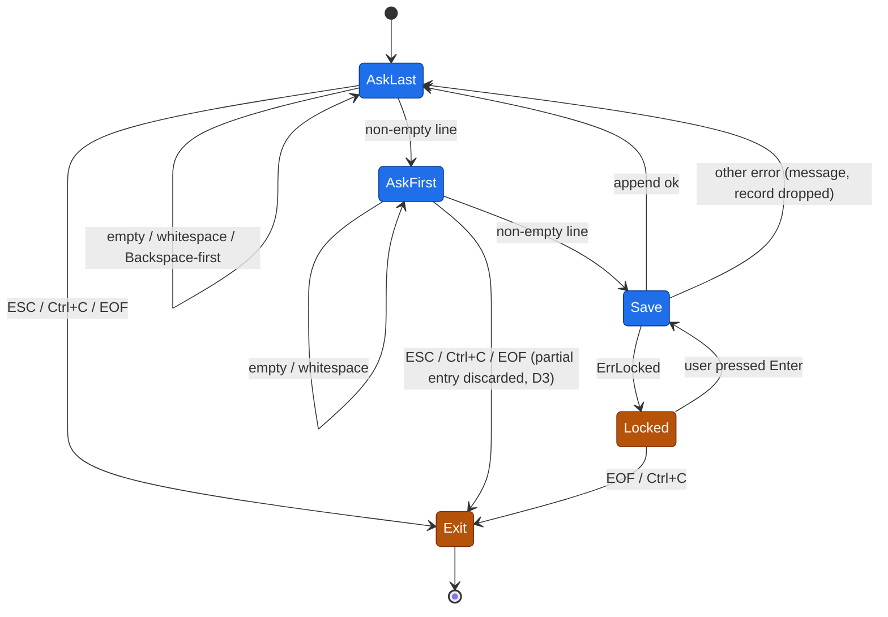

# Tech Specs — exam-ticket-generator

Authority: `Task.md` (requirements) › `agents/TEMP/exam-ticket-generator/coding-flow-state.md` D1–D7 (binding decisions) › `PLAN.md` (approved design).
Companion: `exam-ticket-generator-PLAN.md` owns HOW (ordered steps). This file owns WHAT (contracts, behavior, acceptance). No duplication.

## TLDR

- Go console app, module `pad-lab1`, 4 files: `main.go`, `internal/keys/keys.go`, `internal/journal/journal.go`, `go.mod`.
- Loop: `Last name:` → `First name:` → ticket `1..20` → print `Билет № N` → append row to `journal.xlsx` → repeat. ESC at either prompt exits (D3).
- ESC capture = one-key raw read, then terminal restored, then the rest of the line read in cooked mode. **Any** `0x1b` exits (D7).
- **One** package-level `*bufio.Reader` shared by the raw read and the line read — a per-call reader loses over-read bytes.
- First key is read as a **rune**, not a byte (D6) — a byte read corrupts the echo of Cyrillic surnames.
- Persistence: `excelize` full rewrite → `SaveAs(tmp)` → `fsync` → `os.Rename(tmp, journal.xlsx)`. Save after every student.
- Lock detection (D5): marker files `~$journal.xlsx` **or** `.~lock.journal.xlsx#` in the journal's directory; `errors.Is(err, fs.ErrPermission)` as secondary post-check. Either → `ErrLocked` → message + retry the *same* student.
- **Known accepted risk R1:** no office suite on this machine is confirmed to write either marker (Excel is not installed; only ONLYOFFICE). Check 12 may not fire in real use — see §10.
- Injectable seams are mandatory (tests phase follows): `journal.New(path)`, `keys.NewPrompter(in, out, fd)` with `fd = -1` disabling raw mode.
- Acceptance = Task.md checks 9–13 + `go build ./...` and `go vet ./...` silent.

---

## 1. Scope

In scope: interactive console loop, ESC/Ctrl+C exit, input validation, ticket generation, xlsx create/append, locked-file recovery.

Out of scope (YAGNI, coursework): Windows/Linux support (D2 — macOS only), ticket uniqueness (D4), `lsof`-based or any process-inspecting lock detection (rejected by the user under D5), config files, logging framework, i18n, concurrent access, CSV/other formats, terminal resize handling, ANSI escape-sequence parsing (D7).

## 2. NFR / ASR

| # | Requirement | Source | Mechanism |
|---|---|---|---|
| N1 | Durability after each entry; a crash must not lose prior rows | Task.md:32 | temp-file + `fsync` + `os.Rename` |
| N2 | Never crash on a locked file | Task.md:36 | `ErrLocked` sentinel + retry loop |
| N3 | Terminal must be left usable on every non-`SIGKILL` exit | derived | raw window ≤ 1 key; `defer term.Restore`; no `os.Exit` while raw |
| N4 | Existing rows never modified | Task.md:21,47 | append-only row index; header written only into a completely empty sheet |
| N5 | Testable without a live TTY — **mandatory**, a tests session follows implementation | workflow | `fd = -1` bypass; injectable path; pure helpers |
| N6 | KISS — readable coursework, 4 files, no abstraction layers beyond N5 | prompt | no interfaces |

Security: not applicable. No network, no credentials, no PII beyond names typed by the operator into a local file. STRIDE skipped per scope.

## 3. Architecture

```
main.go                      app loop, prompts, ticket, user-facing messages, exit
internal/keys/keys.go        Prompter: raw first-key read + cooked line read; ESC/Ctrl+C/EOF classification
internal/journal/journal.go  Journal: xlsx open-or-create, next-row derivation, atomic save, lock detection
go.mod                       module pad-lab1, go 1.26
```

Dependency direction: `main` → `keys`, `main` → `journal`. `keys` ⟂ `journal` (no coupling). Neither imports `main`.



## 4. Contracts

### 4.1 `internal/keys`

```go
package keys

// Prompter owns the ONLY reader over its input stream.
type Prompter struct { /* in *bufio.Reader; out io.Writer; fd int */ }

// fd < 0, or a non-terminal fd, disables raw mode: Prompt degrades to a plain
// line read (ESC is then unreachable, which is correct for pipes and tests).
func NewPrompter(in io.Reader, out io.Writer, fd int) *Prompter
func NewStdinPrompter() *Prompter // in=os.Stdin, out=os.Stdout, fd=int(os.Stdin.Fd())

// Prompt writes label, reads one line. Returns the RAW (untrimmed) line.
// ok=false ⇒ caller must terminate the program (ESC, Ctrl+C, or EOF).
func (p *Prompter) Prompt(label string) (text string, ok bool, err error)

// ReadLine reads a line with no raw phase — used for "press Enter to retry".
// ok=false ⇒ EOF.
func (p *Prompter) ReadLine() (ok bool, err error)
```

Internal, pure, unit-testable:

```go
type keyClass int
const (classChar keyClass = iota; classQuit; classEnter; classIgnore)

func classify(r rune) keyClass
```

`classify` retained as a named function rather than inlined into the read loop: it is the only branch-dense logic in the package and it is unreachable from a test once inlined (the loop around it needs a TTY). N5 makes that seam mandatory. It is now a pure single-argument switch.

| Rune | Class | Meaning |
|---|---|---|
| `0x1b` ESC | `classQuit` | exit — **any** `0x1b`, no escape-sequence discrimination (D7) |
| `0x03` Ctrl+C | `classQuit` | raw mode disables SIGINT; handled explicitly |
| `0x0d` CR | `classEnter` | Enter in raw mode is **CR**, not LF |
| `0x0a` LF | `classEnter` | tolerated for piped/odd terminals |
| `0x7f` DEL, `0x08` BS | `classIgnore` | nothing to erase — re-read the first key |
| anything else | `classChar` | first character of the line |

### 4.2 `internal/journal`

```go
package journal

// ErrLocked — journal.xlsx is held by an office application; the caller may retry.
var ErrLocked = errors.New("journal.xlsx занят")

// ErrBlankSheet — the sheet has rows but every one of them is blank; refusing to
// guess a target row rather than risk writing over row 1.
var ErrBlankSheet = errors.New("лист содержит только пустые строки")

type Journal struct { /* path string */ }
func New(path string) *Journal          // path injectable ⇒ tests use t.TempDir()
func Default() *Journal                 // New("journal.xlsx")

// Append adds exactly one row. Creates the file with a header if absent.
// Existing rows are never read-modified-written by value.
func (j *Journal) Append(last, first string, ticket int, when time.Time) error
```

Internal, pure, unit-testable:

```go
// nextRow returns the 1-based row number to write into:
// (index of the last row holding a non-whitespace cell) + 2.
// Returns ErrBlankSheet if no row holds one. Callers must handle len(rows)==0
// before calling (that is the header-creation path, not an error).
func nextRow(rows [][]string) (int, error)

// lockMarkerPaths returns the marker filenames to probe for the given xlsx path,
// in the journal's own directory (D5):
//   filepath.Join(dir, "~$"+base)            — Microsoft Excel owner file
//   filepath.Join(dir, ".~lock."+base+"#")   — LibreOffice / ONLYOFFICE style
func lockMarkerPaths(path string) []string
```

### 4.3 `main.go`

```go
func formatTicket(n int) string // "Билет № 7" — pure
func main()
```

## 5. Behavior

### 5.1 Prompt sequence — exact ordering (N3, echo correctness)

`Prompter.Prompt(label)`:

1. Write `label` to `out`. No newline.
2. If raw is disabled (`fd < 0` or `!term.IsTerminal(fd)`) → go to step 9 with no consumed rune.
3. `old, err := term.MakeRaw(fd)`; on error → treat as raw-disabled, go to 9.
4. `defer term.Restore(fd, old)` — runs on normal return **and during panic unwinding**. Nothing in this function may call `os.Exit`.
5. `r, _, err := p.in.ReadRune()`.
6. `classify(r)`:
   - `classQuit` → restore, write `"\n"`, return `("", false, nil)`.
   - `classEnter` → restore, write `"\n"`, return `("", true, nil)` — caller sees an empty line and re-prompts (check 13).
   - `classIgnore` → loop back to step 5, still in raw mode.
   - `classChar` → continue.
   - `err == io.EOF` → restore, return `("", false, nil)`.
7. **Restore the terminal now**, before any further I/O. (`term.Restore`; the deferred call is harmless — a second `tcsetattr` with the same state.)
8. Echo the consumed rune manually: `io.WriteString(out, string(r))`. Echo was off when it was typed, so it is not on screen yet. Echo **after** restore so the cursor and any subsequent kernel echo agree.
9. `rest, err := p.in.ReadString('\n')` — cooked mode, kernel echoes and handles Backspace for the remainder.
10. Return `string(r) + rest, true, nil`. On `io.EOF` with a partial `rest`, return that partial line with `ok=true`; on `io.EOF` with `rest == ""` and no consumed rune, return `("", false, nil)`.

Rationale for the ordering: raw mode is entered for exactly one keystroke, so the window in which a `SIGKILL` could strand the terminal is minimal (N3), and every character after the first behaves like ordinary terminal input — no hand-rolled line editor.

Reading a **rune** and not a byte (D6): `И` is `0xD0 0x98`. A one-byte read echoes `0xD0` alone — an invalid UTF-8 fragment — and the operator sees a replacement glyph even though the stored string ends up correct. `bufio.Reader.ReadRune` returns ASCII immediately and blocks only for the continuation bytes of a genuine multi-byte lead, which the terminal delivers in the same `read(2)`.

### 5.2 Shared reader — resolution of the PLAN.md §2 hazard

`PLAN.md:94` builds `bufio.NewReader(os.Stdin)` inside the prompt, while `PLAN.md:83` reads the first byte straight from `os.Stdin`. **Decision: one `*bufio.Reader`, owned by `Prompter`, constructed once.**

Why: `bufio.Reader` issues one `read(2)` into a 4096-byte buffer. In raw mode a paste or a fast typist delivers several bytes in that one syscall. Bytes past the one we classified live inside *that* reader instance; discarding the instance discards them, and the next prompt starts mid-line. A single shared instance is the only variant where no byte can be lost. The alternative — unbuffered byte-at-a-time `os.Stdin.Read` line assembly — requires hand-writing Backspace/echo handling that `Task.md:42-43` and `PLAN.md:42-43` deliberately rejected as the harder option.

Consequence: `keys` must never read `os.Stdin` directly, and `main` must construct exactly one `Prompter`.

### 5.3 ESC handling (D7)

Any `0x1b` exits. No escape-sequence discrimination, no `Buffered()` probe, no timeout.

Accepted consequence, stated for the operator: arrow keys, Home/End, and function keys emit `0x1b` as their first byte and will therefore **quit the application**. `PLAN.md:143-146` chose this deliberately and D7 reaffirms it. The trade is simplicity against a class of keypresses no acceptance check exercises; the residual escape-sequence bytes left in the reader are irrelevant because the process is exiting.

### 5.4 Terminal restoration on every exit path

| Path | Restored? | Mechanism |
|---|---|---|
| ESC / Ctrl+C | yes | explicit `Restore` before returning, plus the `defer` |
| Enter / normal line | yes | explicit `Restore` at §5.1 step 7 |
| `panic` anywhere below `Prompt` | yes | Go runs deferred functions during panic unwinding |
| unexpected read error | yes | `defer` |
| `SIGINT` from a *non-raw* read (retry prompt) | yes | raw mode is not active there; default handler applies |
| `SIGKILL` (check 11) | **no** — see §10 L1 | unavoidable |

Hard rules: (a) `term.MakeRaw` is called in exactly one function; (b) `os.Exit` is never called while raw mode is active — quit is signalled by `ok=false` and `main` returns normally; (c) no `signal.Notify` handler is installed (raw mode suppresses tty-generated SIGINT anyway, and a handler cannot help against `SIGKILL`).

### 5.5 Ctrl+C in raw mode

`ISIG` is cleared by `MakeRaw`, so `0x03` arrives as a byte and no signal is delivered. It is classified `classQuit`: terminal restored, `"\n"` written, program exits **0** through the same path as ESC. Rationale: identical, predictable teardown; the conventional exit code 130 would require `os.Exit`, which cannot run the restore defers.

Outside raw mode (the "press Enter to retry" read), Ctrl+C is a real SIGINT and kills the process with the terminal already cooked — this is the retry loop's escape hatch (§5.8).

### 5.6 Input validation (Task.md:34, check 13)

`main` trims with `strings.TrimSpace` and re-prompts on `""`. Applies to both fields. Nothing is written, no ticket is generated, no file is touched. A bare Enter is caught earlier as `classEnter` and produces the same empty-string outcome — one code path, two entry points.

### 5.7 Persistence (Task.md:21,32; checks 9, 10, 11)

`Append` algorithm:

1. For each `p` in `lockMarkerPaths(j.path)`: `if _, err := os.Stat(p); err == nil → return ErrLocked` (pre-check, D5 primary).
2. File absent (`os.Stat(j.path)` → `fs.ErrNotExist`):
   `f := excelize.NewFile()`; `sheet := "Sheet1"`; write `headers` into `A1`; bold style via `NewStyle`+`SetRowStyle(sheet,1,1,id)`; `SetColWidth(sheet,"A","D",18)`; target row = `2`.
3. File present: `f, err := excelize.OpenFile(j.path)`; `sheet := f.GetSheetName(0)` — **not** a hardcoded `"Sheet1"`; `rows, err := f.GetRows(sheet)` with the error **checked**; if `len(rows) == 0` write the header at `A1` and target row `2`, else `n, err := nextRow(rows)` and propagate `ErrBlankSheet`.
4. `defer f.Close()`.
5. `f.SetSheetRow(sheet, fmt.Sprintf("A%d", n), &[]any{last, first, ticket, when.Format("2006-01-02 15:04:05")})`.
6. `tmp := j.path + ".tmp"`; `f.SaveAs(tmp)`; open `tmp`, `Sync()`, close; `os.Rename(tmp, j.path)`.
7. On any error in step 6: `os.Remove(tmp)` (best effort), then if `errors.Is(err, fs.ErrPermission)` return `ErrLocked` else return the wrapped error.

`nextRow` derivation (trailing-blank-row hazard): `GetRows` is documented to fetch "the rows with value or formula cells" and to skip trailing blank cells, but it is **not** contractually guaranteed to drop every trailing all-blank row — a row materialised as an empty `<row>` element can still surface. `len(rows)+1` (`PLAN.md:53`) would then leave a gap or drift. `nextRow` scans backwards for the last row containing a cell whose `TrimSpace` is non-empty and returns that index `+2`. It never overwrites (N4) because it only ever returns a row strictly after the last populated one. If no such row exists it returns `ErrBlankSheet` rather than `1` — returning `1` would place the write on the header row, which N4 forbids; a sheet with rows but no content is a corrupt file, and refusing is the safe answer.

Timestamp: fixed string `"2006-01-02 15:04:05"`, written as text. A real Excel serial-date cell renders per the viewer's locale and OS date settings, which makes the grader's visual check machine-dependent and needs a number-format style to be legible at all. A fixed string is byte-identical everywhere, sorts lexicographically, and is trivially diffable. Cost: no date arithmetic on the column — irrelevant here.

Full-rewrite caveat, unchanged from `PLAN.md:135-139`: excelize rewrites the whole workbook. Cell *values* of existing rows are preserved (satisfying `Task.md:21`); externally-added manual formatting or formulas may not be.

### 5.8 Locked-file flow (Task.md:36, check 12)

On `errors.Is(err, journal.ErrLocked)`, `main`:

1. prints, verbatim from `PLAN.md:112`:
   `Файл journal.xlsx открыт в Excel. Закройте его и нажмите Enter для повтора.`
2. `p.ReadLine()` — cooked mode, no raw phase.
3. retries `journal.Append` with the **same** `last`, `first`, `ticket`, `when`. The ticket was already printed to the operator (`PLAN.md:113-114`); regenerating or dropping it would contradict the screen.

Exit conditions of the retry loop: (a) `Append` returns `nil` → break, continue to the next student; (b) `ReadLine` returns `ok=false` (EOF) → program exits cleanly; (c) Ctrl+C → real SIGINT, process dies, terminal already cooked. The loop is unbounded but never inescapable.

`when` is captured **once**, before the first `Append` attempt, so the recorded time is the time of entry, not the time the file was finally released.

The message names Excel specifically. Retained verbatim per `PLAN.md:112` even though this machine has ONLYOFFICE rather than Excel — `Task.md:36` phrases the requirement in terms of Excel, and the grader reads that wording.

Non-`ErrLocked` errors (including `ErrBlankSheet`) are not retried: `main` prints `Не удалось сохранить запись: <err>` to stderr and returns to the `Last name:` prompt. Task.md requires only that the app not crash.

### 5.9 Console I/O literals

| Literal | Source |
|---|---|
| `Для выхода нажмите ESC.` + `\n`, once at startup | Task.md:12 |
| `Last name: ` (trailing space, no newline) | Task.md:13 |
| `First name: ` (trailing space, no newline) | Task.md:14 |
| `Билет № %d\n` → `Билет № 7` (`№` = U+2116) | Task.md:16 |
| `Файл journal.xlsx открыт в Excel. Закройте его и нажмите Enter для повтора.` | PLAN.md:112 |

The trailing space after the colon is presentation only; the graded literal is `Last name:` / `First name:`.

## 6. Data model — `journal.xlsx`

Sheet: first sheet of the workbook (`Sheet1` when we create it).

| Col | Header (row 1) | Row ≥2 type | Value |
|---|---|---|---|
| A | `Last name` | string | trimmed surname |
| B | `First name` | string | trimmed given name |
| C | `Номер билета` | number | `1..20` |
| D | `Дата и время` | string | `2006-01-02 15:04:05` |

Header row 1: bold, column widths A–D = 18.

## 7. Error semantics

| Condition | Detection | Surface | App behavior |
|---|---|---|---|
| journal held by an office app | `~$journal.xlsx` or `.~lock.journal.xlsx#` exists | `ErrLocked` | message + retry same student |
| write denied | `errors.Is(err, fs.ErrPermission)` on SaveAs/Rename | `ErrLocked` | same |
| sheet has rows but all blank | `nextRow` | `ErrBlankSheet` | message, drop record, next student |
| corrupt / unreadable xlsx | `OpenFile` error | wrapped error | message, drop record, next student |
| `GetRows` error | returned error | wrapped error | same |
| rename failed | `os.Rename` error | wrapped error | same; `tmp` removed |
| stdin EOF | `io.EOF` | `ok=false` | clean exit 0 |
| `MakeRaw` fails / not a TTY | `term.IsTerminal` / error | none | silently degrade to cooked line reads |

Two sentinels, no error hierarchy (YAGNI). All wrapping via `fmt.Errorf("...: %w", err)`.

## 8. Acceptance criteria — traced to Task.md checks 9–13

Column **By** marks who can actually run the row. `HUMAN` rows need a real TTY: `Prompter` deliberately falls back to cooked mode when stdin is not a terminal (§5.1 step 2), so a piped, non-interactive shell cannot drive the raw-mode path at all — an agent piping input verifies nothing about ESC. `AGENT` rows are file- or toolchain-level and need no TTY.

| AC | By | Criterion (observable) | Task.md |
|---|---|---|---|
| AC-9 | HUMAN | Fresh dir, no `journal.xlsx`. Run, enter 3 students, press ESC at `Last name:`. App exits, shell prompt on a fresh line, terminal echo working. | :46 |
| AC-9f | AGENT | Inspect the file AC-9 produced: 4 rows (header + 3); A/B match the input; C ∈ 1..20; D parses as `2006-01-02 15:04:05`. | :46 |
| AC-10 | HUMAN | Run again on that file, enter 2 students, ESC. | :47 |
| AC-10f | AGENT | 6 rows; rows 2–4 identical to the copy captured after AC-9. | :47 |
| AC-11 | HUMAN | Run, enter 1 student, wait for the next `Last name:` prompt, `kill -9 <pid>`. | :48 |
| AC-11f | AGENT | File reopens via `excelize.OpenFile` without error and contains that row; no `journal.xlsx.tmp` present. | :48 |
| AC-12a | AGENT | **Synthetic lock, proves the code path.** With no office app involved, `touch '~$journal.xlsx'`, enter a student → app prints the §5.9 message, does not exit or panic. `rm` the marker, press Enter → the row is written with the ticket already on screen. Repeat with `.~lock.journal.xlsx#`. | :49 |
| AC-12b | HUMAN | **Real-world observation, may fail — see R1.** Open `journal.xlsx` in ONLYOFFICE, run `ls -a` in that directory, record every sibling file that appeared. If one of the two D5 markers is present, run a student entry and confirm the message. If neither is present, record that fact — this AC is then **not satisfied** and the gap is reported, not papered over. | :49 |
| AC-13 | HUMAN | At `Last name:` press Enter → re-prompt. Type `"   "` + Enter → re-prompt. Same at `First name:`. | :50 |
| AC-13f | AGENT | `journal.xlsx` mtime unchanged across AC-13; no row added. | :50 |
| AC-D3 | HUMAN | ESC at `First name:` (after a valid surname) exits; no row is written. | D3 |
| AC-ECHO | HUMAN | Verifies the two first-key behaviors D6/D7 kept in scope: Backspace as the very first key does not exit and does not corrupt the line; a first-letter-Cyrillic surname (`Иванов`) echoes correctly on screen **and** stores correctly in column A. | D6, §4.1 |
| AC-BLD | AGENT | `go build ./...` → empty output, exit 0. `go vet ./...` → empty output, exit 0. | PLAN.md:129 |

Deleted per D7: the former AC-KEY row asserting that arrow keys do not exit. Under D7 arrow keys **do** exit and that is correct behavior. AC-ECHO carries forward only the Backspace and Cyrillic-echo checks from it, both of which cover decisions that remain in force.

## 9. Testability (N5 — mandatory, a tests session follows)

| Unit | How |
|---|---|
| `journal.nextRow` | pure — table test: empty, header-only, trailing blank rows, whitespace-only rows, all-blank ⇒ `ErrBlankSheet` |
| `journal.lockMarkerPaths` | pure — both names, correct directory |
| `journal.Journal.Append` | `New(filepath.Join(t.TempDir(), "journal.xlsx"))` — create-then-append round trip, reread with `excelize.OpenFile`, assert prior rows unchanged |
| `journal.ErrLocked` | `t.TempDir()` + `os.WriteFile` of each marker in turn → assert `errors.Is` |
| `keys.classify` | pure — one case per §4.1 table row |
| `keys.Prompter.Prompt` | `NewPrompter(strings.NewReader("Ivanov\n"), &bytes.Buffer{}, -1)` — raw disabled; asserts line assembly, EOF→`ok=false`, empty-line handling, label written to `out` |
| `main.formatTicket` | pure — `formatTicket(7) == "Билет № 7"` |

Not unit-testable, HUMAN-only: the raw-mode path itself (`MakeRaw`/`ReadRune`/`Restore`) and everything downstream of it. This is why AC-9/10/11/13/D3/ECHO are marked HUMAN in §8.

`main()` stays a thin loop with no branching logic worth testing; the ticket draw is `rand.IntN(20)+1` inline.

## 10. Risks, assumptions, limitations

- **R1 — accepted risk, D5. Lock detection may never fire in real use.** Microsoft Excel is **not installed** on this machine (`/Applications/Microsoft Excel.app` absent); the only office suite present is ONLYOFFICE. It is **unverified** that ONLYOFFICE writes `~$journal.xlsx` or `.~lock.journal.xlsx#`. The user accepted D5 with this risk known and rejected an `lsof`-based check. Consequence: `Task.md` check 12 / AC-12b may not be demonstrable on this machine. AC-12a proves the *code path* is correct and reachable; it does not prove the *trigger* fires. Compounding this, `fs.ErrPermission` is effectively inert on macOS — POSIX `rename(2)` over a file another process holds open succeeds (`PLAN.md:140-142` concedes the same). **Do not claim check 12 as passed on the strength of AC-12a alone.**
- **A2.** `excelize.SetSheetRow` requires a *pointer* to a slice (`&[]any{...}`), per the package examples. Confirmed by usage, not by a quoted doc comment.
- **L1.** `SIGKILL` (AC-11) during the ≤1-keystroke raw window leaves the terminal raw; `reset` restores it. Not fixable in-process. The window is one keystroke wide by design, and AC-11 kills at the prompt *after* the save, so it is not exercised.
- **L2.** Durability is `fsync` on the temp file + `rename`; the containing directory is not fsynced, so a hard power loss immediately after `rename` could in principle lose the rename entry. `Task.md:32` mentions power-off; AC-11 only tests `kill`. Directory fsync omitted deliberately (KISS) — documented gap.
- **L3.** After the terminal is restored mid-line (§5.1 step 7), the kernel line buffer does not contain the manually echoed first character. Pressing Backspace far enough to reach it will not erase it from the screen, and it remains in the stored value. Inherent to the `Task.md:41` "read one key, then read a line" approach.
- **L4.** No ticket uniqueness (D4). Duplicates within a session are expected.
- **L5.** Arrow, Home/End and function keys quit the application (§5.3, D7).

## 11. Deviations from PLAN.md

Applied (all approved):

| PLAN.md | Spec says | Why | User-visible |
|---|---|---|---|
| `:78` `ReadFirstKey() (byte, error)` | read a **rune** (D6) | a byte read echoes half of a 2-byte Cyrillic letter | yes — fixes garbled echo |
| `:94` `bufio.NewReader(os.Stdin)` per call | one shared reader in `Prompter` | over-read bytes are otherwise lost | no |
| `:85,97` `PromptWithESC` + separate `Prompt` | one `Prompt`, both fields (D3) | ESC at `First name:` too | yes |
| `:41-44,52` `const sheetName = "Sheet1"` | `f.GetSheetName(0)` on the open path | a workbook created elsewhere may name its sheet differently | no |
| `:53` `len(rows)+1` | `nextRow` back-scan, `ErrBlankSheet` on all-blank | trailing blank rows; `1` would overwrite the header | only in that edge case |
| `:53` `rows, _ := f.GetRows(...)` | error checked | swallowing it can silently overwrite | no |
| `:70` `~$journal.xlsx` only | both `~$journal.xlsx` and `.~lock.journal.xlsx#` (D5) | Excel is not installed here; ONLYOFFICE is | no |
| `:59-64` `SaveAs` + `Rename` | + `fsync` on tmp, + `os.Remove(tmp)` on failure | `Task.md:32` names power-off; leaked tmp files are untidy | no |
| `:52` no `Close` | `defer f.Close()` | excelize holds temp resources per open file | no |
| `:80` `MakeRaw` unconditionally | guarded by `term.IsTerminal` | piped stdin must not be fatal; required by N5 | no |

Considered and **rejected**:

| Proposal | Ruling |
|---|---|
| ESC + `Buffered() > 0` ⇒ arrow key, ignore | **D7 — rejected.** `PLAN.md:143-146` stands: any `0x1b` exits. Removed from `classify`, from the read loop, and from acceptance (AC-KEY deleted). |
| `0x04` Ctrl+D as an extra quit key | **D7 — rejected.** Not in `PLAN.md`; removed. `^D` now falls through to `classChar`. |
| `lsof`-based lock detection | **D5 — rejected by the user.** Marker files only. |
| Dropping the injectable seams as speculative | **Overruled.** A tests session follows implementation; N5 makes `journal.New(path)`, `keys.NewPrompter(in, out, fd)`, the non-TTY fallback, and the pure helpers required, not optional. |

## 12. Dependencies

| Module | Version | Used API (signature verified on pkg.go.dev) |
|---|---|---|
| `github.com/xuri/excelize/v2` | latest | `func NewFile(opts ...Options) *File` · `func OpenFile(filename string, opts ...Options) (*File, error)` · `func (f *File) SaveAs(name string, opts ...Options) error` · `func (f *File) GetRows(sheet string, opts ...Options) ([][]string, error)` · `func (f *File) SetSheetRow(sheet, cell string, slice interface{}) error` · `func (f *File) NewStyle(style *Style) (int, error)` · `func (f *File) SetRowStyle(sheet string, start, end, styleID int) error` · `func (f *File) SetColWidth(sheet, startCol, endCol string, width float64) error` · `func (f *File) GetSheetName(index int) (name string)` · `func (f *File) Close() error` |
| `golang.org/x/term` | latest | `func MakeRaw(fd int) (*State, error)` · `func Restore(fd int, oldState *State) error` · `func IsTerminal(fd int) bool` |
| stdlib | Go 1.26.2 | `math/rand/v2`: `func IntN(n int) int` — global source is randomly seeded, v2 has no top-level `Seed`; `bufio`, `errors`, `io/fs`, `os`, `path/filepath`, `strings`, `time`, `fmt` |

`NewFile` returns `*File` with **no** error. Default sheet name is `Sheet1`.
